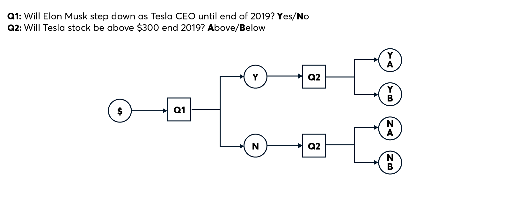
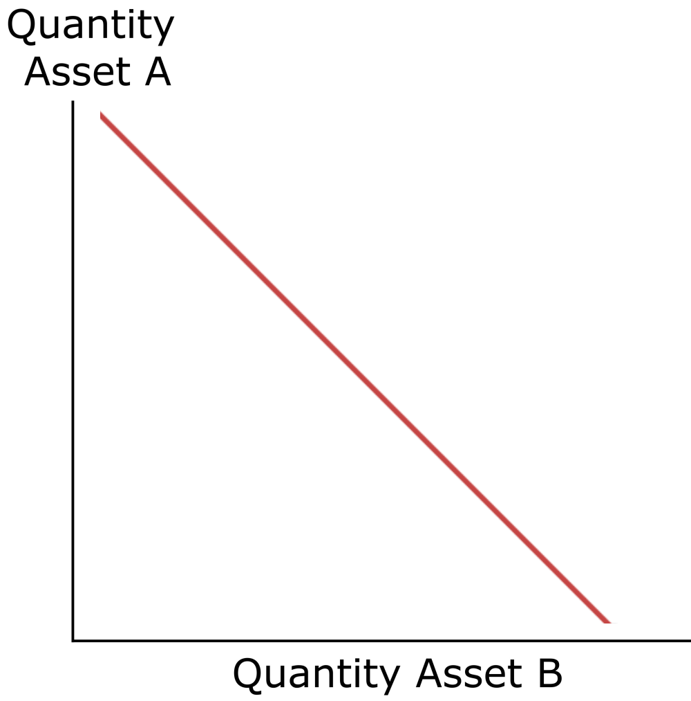

## What are Prediction Markets?

A __Prediction Market__ is a market where people can trade contracts that pay based on the outcomes of unknown future events. The market prices generated from these contracts can be understood as a kind of collective prediction among market participants.

---

## What are Conditional Tokens ?

__Conditional Tokens__ are a new, application-agnostic, asset class designed to facilitate the creation of highly liquid prediction markets. They enable combinatorial outcomes for high resolution information discovery through prediction markets.

---

## What is Gnosis?

__Gnosis__ developed the conditional tokens framework, which powers decentralized prediction markets.
for more -  [Gnosis](https://docs.gnosis.io/conditionaltokens/)

---

## Examples of Conditional Tokens :

[Will Elon Musk step down as CEO of Tesla on or before December 31, 2020?](hhttps://docs.gnosis.io/conditionaltokens/docs/introduction1/)
[Will the share price of Tesla stock be LESS THAN $300 at market close, December 31, 2020?](hhttps://docs.gnosis.io/conditionaltokens/docs/introduction1/)



---
## Project Structure 

- CTHelpers.sol 
- ConditionalTokens.sol
- MyBet.sol
- CSAMM.sol
- Token.sol

---

## Terminologies :
- __oracle__ : The account assigned to report the result for the prepared condition
- __questionId__ : An identifier for the question to be answered by the oracle.
- __outcomeSlotCount__ : The number of outcome slots which should be used for this condition. Must not exceed 256.
- __spender__ : Condition Token Contract Address.
- __amount__ : amount of collateral to stake.
- __collateralToken__  : The Token which users are staking usually ERC20 used.
- __parentCollectionId__ : The ID of the outcome collections common to the position being split and the split target positions.
- __conditionId__ : The ID of the condition to split on.
- __partition__ : An array of disjoint index sets representing a nontrivial partition of the outcome slots of the given condition. E.g. A|B and C but not A|B and B|C (is not disjoint).
---

## 1. CTHelpers.sol : 

```sh
function getConditionId(address oracle, bytes32 questionId, uint outcomeSlotCount)
```
This method is used to create a unique ID for condition using provided params.

```sh
function getCollectionId(bytes32 parentCollectionId, bytes32 conditionId, uint indexSet)
```
This method is used to create different IDs for each outcome slots.

```sh
function getPositionId(IERC20 collateralToken, bytes32 collectionId)
```
This method is used to create different IDs for mapping each Token with different Collection IDs.

---

## 2. ConditionalTokens.sol :

```sh
function prepareCondition(address oracle, bytes32 questionId, uint outcomeSlotCount)
```
This method is used to prepare a condition inside CT contract.

```sh
function getOutcomeSlotCount(bytes32 conditionId)
```
If any condition is properly prepared , then this method will sccessfully return total no. of outcome slot counts.

```sh
Outcome Slots : 
Question1 : "Will the summer 2020 in Germany break again weather records? "
Possible answers : [Yes,No] or [0,1] (disjoint)
Bitmap representation : [0x01,0x10]
Index set :[1,2]

Question2 : "Who will win IND vs PAK match today ? "
Possible answers : [IND,PAK,DRAW] or [0,1,2]
Bitmap representation : [0x001,0x010,0x100]
Index set : [1,2,4]

Question2 : "Who will win score more than 30 runs today Rohit,Virat,Dhoni --> (A,B,C) ? "
Possible answers : [A,B,C,(A|B),(B|C),(A|C)] 
Bitmap representation : [0x001,0x010,0x100,0x011,0x110,0x101]
Index set : [1,2,4,6,5]
```
Index sets are created using Outcome slots condition.

```sh
function approve(address spender, uint256 amount)
```
Before transacting any collateral into CT contract , Owner must approve the access for CT contract. If amount is approved then CT will accept collateral stakes from Owner of Token.

```sh
function splitPosition(
        IERC20 collateralToken,bytes32 parentCollectionId,
        bytes32 conditionId,uint[] calldata partition,uint amount )
```

This function splits a position. If splitting from the collateral, this contract will attempt to transfer `amount` collateral from the message sender to itself.

```sh
function mergePositions(
        IERC20 collateralToken,bytes32 parentCollectionId,
        bytes32 conditionId,uint[] calldata partition,uint amount )
```

Using this method Owner of collateral can retrive the tokens spent on CT contract.

```sh
function reportPayouts(bytes32 questionId, uint[] calldata payouts)
```
Method Called by the oracle for reporting results of conditions. Brings the real worlds result od conditions into the Our smart contract.

```sh
function safeTransferFrom(
        address from,address to,uint256 id,
        uint256 amount,bytes memory data
    ) 
```

Gnosis CT contract inherits this method from ERC1155 ,henc it is assumed tha all the collateral token holder have implemented  __IERC1155Receiver__  interface in their contract , so the can recieve the payout fro CT contract safely.

```sh
function redeemPositions(IERC20 collateralToken, bytes32 parentCollectionId, bytes32 conditionId, uint[] calldata indexSets)
```

This method is used by collateral owners to reedem the tokens they have staked & they should be returned as per the result provide by oracle.

---

## 3. Token.sol ( ERC20 )

Inherits all the functionality from __openzeppelin-contracts/ERC20__ repo.

```sh
function mint(address account, uint256 amount)
```
Method used to mint new TOKENS into address provided of given amount.

```sh
function onERC1155Received(
        address operator,address from,
        uint256 id,uint256 value,bytes calldata data
    )
```

Methor used to redeem the tokens from CT contract.

## 4.CSAMM.sol

What is Constant Sum Automated Market Maker?

This design simply replaces the multiplication in Constant Product with addition (x + y = z). Liquidity in the pool equals the total value of Asset A plus the total value of Asset B.



```sh
constructor(address _token0, address _token1)
```
Both Token address needs to be supplied to contract.

```sh
function _mint(address _to, uint _amount)
```
Used to mint tokens for any user into CSAMM contract.

```sh
function _burn(address _from, uint _amount)
```
Used to burn the tokens for any user from CSAMM contract.

```sh
function _update(uint _res0,uint _res1) 
```
To update the liquidity pool of CSAMM contract.
```sh
function swap(address _tokenIn,uint _amountIn)
```
Used to swapn Token1 with Token2 ,swapping is done according to the Token2 reserve currently present in the contract using this formula (x + y = z).

```sh
function addLiquidity(uint amount0, uint amount1)
```
Used to add Tokens inside liquidity pool by any user.

```sh
function removeLiquidity(uint _shares)
```
Used to remove liquidity from liquidity pool.

---
## 5. MyBet.sol
__State variables :__
```sh
ks = for storing ERC token
conditionalTokens = for stroing CT
public oracle = for storing oracle account address
tokenBalance == used to store each outcome slots token amounts stakes
admin = to store address of contract creator
outcomecount = to store total outcomes
betStatus = to store current status of bet
betresultarray = to store result provided by oracle.
```

```sh
constructor (address _ks,address _conditionalTokens,address _oracle)
```
- ___ks__ : address of Collateral Token.
- ___conditionalTokens__ : address of Conditional Token.
- ___oracle__ : address of Oracle account.

```sh
function createBet(bytes32 questionID,uint amount)
```
Used by any user to create bet on given question ID.
1)  Condition is prepared
2) Index set is calculated
3) CT address is approved by owner for amounts wants to be staked
4) CT split the collateral tokens with Conditional tokens.

```sh
function reverseBet(bytes32 questionID,bytes32 conditionID,uint[] calldata partition,uint amount)
```
Method used to retrive the tokens staked to CT back to owner's account.

```sh
function betResult(bytes32 questionID,uint[] calldata partition)
```
Method used to get the result provided by Oracle.

```sh
function transferTokens  (
        bytes32 questionId, uint indexSet, 
        address to, uint amount
    )
```

1) Create position IDs for all outcomes
2) Safe transfer tokens back to owner

```sh
function reedemTokens(
        bytes32 conditionId,uint[] calldata indexSet
    )
```

Used to reedem the tokens after results are declared by oracle.

---


## License

MIT
